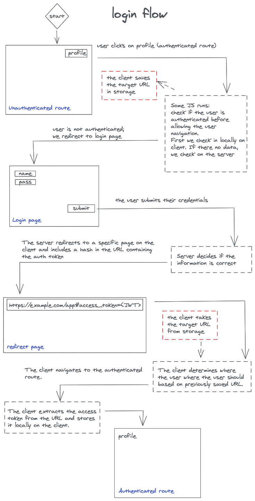
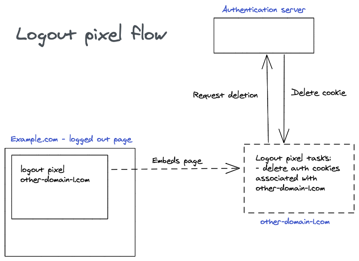

# OIDC Implicit Core

## How to set the OIDC Config

```ts
import configService from "@hawaii-framework/oidc-implicit-core/dist";

configService.config = {
  authorisation: "",
  client_id: "",
  ...etc,
};
```

## How to set the Auth headers on API requests

To access resources, a request may need to include authentication information. This is done via te authorization header. In the following example, we use axios' request interceptors to add this authorization header. Take caution that you only include this header in requests for protected resources; simply including the header in every request is a security risk. With axios, you may create various axios instances with different interceptors to deal with this. With other implementations, you may need to include headers at a request level.

```ts
import configService, {
  TokenService,
  SessionUtil,
  SessionService,
} from "@hawaii-framework/oidc-implicit-core/dist";

const setAuthHeader = async (
  config: AxiosRequestConfig
): Promise<AxiosRequestConfig> => {
  const storedToken = TokenService.getStoredToken();

  if (storedToken) {
    config.headers["Authorization"] = SessionUtil.getAuthHeader(storedToken);

    // For info see Token Expiration section in Readme
    if (storedToken.expires - Math.round(new Date().getTime() / 1000.0) < 300) {
      SessionUtil.silentRefreshAccessToken();
    }
    return config;
  } else {
    // The check session method will either return
    // that the user is indeed logged in, or redirect
    // the user to the login page. This redirection
    // will be triggered automatically by the library.
    const isLoggedIn = await SessionService.checkSession();
    if (isLoggedIn) {
      config = await setAuthHeader(config);
      return config;
    } else {
      throw new axios.Cancel("User is not logged in");
    }
  }
};

// Add a request interceptor
axios.interceptors.request.use(setAuthHeader, (error) => {
  Promise.reject(error);
});
```

## How do I check if the user is authenticated?

On a page level, users should be redirected if they are not authenticated. For this, you can use the check session method. Do note that this method returns a Promise.

```ts
import { SessionService } from "@hawaii-framework/oidc-implicit-core/dist";

// Somewhere in your router
SessionService.checkSession().then((isAuthenticated) => {
  if (isAuthenticated) {
    // We may proceed.
  }
});
```

On a component level, you need to make sure at least a token is stored

```ts
import { TokenService } from "@hawaii-framework/oidc-implicit-core/dist";

// If a token is stored, we can assume the user is logged in. This call is synchronous and will as such not influence rendering the page.
TokenService.getStoredToken();
```

## Token expiration

Often times, the access token is set to expire after a certain period. Before this period is over, we can still request a new token. The renewal of a token should only take place as long as the user continues to use the application. If the application renews tokens without paying attention to user activity, it is a potential threat to the security of the user's information.

A common way to detect application usage is to hook into requests that have been authenticated. These are either requests to the backend API (i.e. requests to protected resources) or front-end navigation to routes that require authentication. In addition, the necessity of creating a new token must be considered. If the expiration time is still far in the future, it should be decided not to renew the token yet.

```ts
import {
  SessionUtil,
  SessionService,
  Token,
  TokenService,
} from "@hawaii-framework/oidc-implicit-core/dist";

const refreshTokenAboutToExpire = (token?: Token) => {
  if (
    token &&
    // The expiry time is calculated in seconds since 1970
    // Check if the token expires in the next 5 minutes, if so, trigger a
    // silent refresh of the Access Token in the OIDC Service
    token.expires - Date.now() / 1000 < 300
  ) {
    SessionUtil.silentRefreshAccessToken();
  }
};

// ==================================================
// == SOMEWHERE IN THE ROUTER AUTHENTICATION CHECK ==
// ==================================================
SessionService.checkSession().then((isAuthenticated) => {
  if (isAuthenticated) {
    const storedToken = TokenService.getStoredToken();
    // If the authentication was successful, we request
    // a new token (if it is about to expire).
    refreshTokenAboutToExpire(storedToken);

    // Returning the auth check result here...
  }
});

// =================================
// == SOMEWHERE IN AN API REQUEST ==
// =================================
const storedToken = TokenService.getStoredToken();
if (storedToken) {
  config.headers["Authorization"] = SessionUtil.getAuthHeader(storedToken);
  // After adding the headers, we request
  // a new token (if it is about to expire).
  refreshTokenAboutToExpire(storedToken);
}
```

## Login

The login consists of two steps. Step 1 is to send authentication data to the server (username and password and csrf token). Step 2 is processing the response from the server.
#TODO: ADD LOGIN

### Processing the response from the server
An auth token will be present in a response from the server after a successful login. This token must be stored on the user's local computer. The auth token is present in the hash fragment of the redirect url from the server to the client. So, you need to make sure you will not clear the URL before saving it locally.
```ts
// The check session method is used for both checking if the user is logged in
// as well as saving the access token present in the URL hash.
// After the URL has been saved, it will be cleared.
await SessionService.checkSession();
```

The current implementation of the redirect from the server only goes to a single URL. This means that restoring the user session (the url where the user was before logging in) is a responsibility of the front-end. Take into account that routes which do not require authentication should not call the check session function (as it will trigger a login).

Because the check session function is used both for the login check and to store the token, it is recommended to do a front-end redirect where the URL hash is kept intact before the check session is used to store the token. This way the user is sent to the correct route after login, which calls the check session anyway (to check if the user is logged in) and consequently also stores the token.




## Logout

The logout form needs a **logout endpoint**, a Cross Site Request Forgery Token (**\_csrf**), a URL to redirect to after the logout has succeeded (**post_logout_redirect_uri**) and an ID Token (**id_token_hint**). The form can be submitted in an automated fashion after all inputs have been set. If the _\_csrf_ or _id_token_hint_ cannot be resolved, an error page should be shown.

```ts
import configService from "@hawaii-framework/oidc-implicit-core/dist";

// The LOGOUT_ENDPOINT can be requested from
configService.config.logout_endpoint;

// The POST_LOGOUT_REDIRECT_URI can be requested from
configService.config.post_logout_redirect_uri;

// The CSRF_TOKEN can be requested from
//  Synchronously (try this first)
StorageUtil.read("_csrf");
//  Asynchronously
TokenService.getCsrfToken();

// The ID_TOKEN_HINT can be requested from
TokenService.getIdTokenHint({ regex: true });
```

```html
<form method="POST" action="LOGOUT_ENDPOINT">
  <input type="hidden" name="_csrf" value="CSRF_TOKEN" />

  <input
    type="hidden"
    name="post_logout_redirect_uri"
    value="POST_LOGOUT_REDIRECT_URI"
  />

  <input type="hidden" name="id_token_hint" value="ID_TOKEN_HINT" />
</form>
```

## Automatic logout

If the session is closed due to inactivity, the user must be logged out to protect the data still on the local computer from access by unauthorised parties. After redirecting to the logged out page, the authentication information will be removed.

```ts
import {
  TokenService,
  SessionService,
} from "@hawaii-framework/oidc-implicit-core/dist";

const autoLogoutInterval = setInterval(() => {
  // Get stored token either returns a non-expired token or null
  const storedToken = TokenService.getStoredToken();

  if (!storedToken) {
    SessionService.isSessionAlive().catch(() => {
      // If we are not logged in, no expired check is needed.
      clearInterval(autoLogoutInterval);

      // Remove user information that may exist next to the auth information
      clearUserInformation();

      // You may set a session restore URL here to be used on the
      // login page.
      setSessionRestoreUrl();

      // Navigate to the logged out page via the router.
      navigateToLoggedOutPage();
    });
  }
}, 15000);
```

## Logged out page

See the FAQ for the difference between a logout page and a logged out page.

The logged out page is used to show the user that he has been logged out. Next to this, it should remove local authentication information. This includes local storage on the current domain as well as cookies on other domains via a logout pixel.

### Clean up

```ts
import { SessionService } from "@hawaii-framework/oidc-implicit-core/dist";

// Upon opening the logged out page
SessionService.cleanSessionStorage();
```

### Logout pixel

In case there multiple domains that need to be logged out at once, you may choose to include logout pixels. With a logout pixel, you include an invisible iframe or image on the site which is hosted on another domain. The embedded element contains some logic to logout on the hosting domain. In this way the same domain policy for cookies and other local ways authentication data storage can be circumvented.


```html
<!-- As iframe -->
<iframe
  src="https://example.com/logoutpixel"
  width="0"
  height="0"
  class="hidden"
></iframe>

<!-- As img -->

```

If you are creating a logout pixel, you need to:

1.  Make an array of all access tokens in the session storage
    1.  Call the logout endpoint with each token
    1.  Remove the token from session storage
1.  Remove the \_csrf token from session storage

## FAQ

### What is a silent logout?

With a silent logout, you are logged out in the background. This means that you are not redirected to a logged-out page. However, the access token will be invalidated. You would use this when you need the user to be logged out in order to perform a certain action. If you are going to use this method, be sure to clean the session storage afterwards.

```ts
import {
  SessionService,
  SessionUtil,
} from "@hawaii-framework/oidc-implicit-core/dist";

SessionUtil.silentLogoutByUrl().then((loggedOut) => {
  if (loggedOut) {
    SessionService.cleanSessionStorage();
  }
});
```

### What is the difference between a logout page and a logged out page?

- The purpose of a **logout page** is to initiate and authorise the termination of a session.
- The purpose of a **logged out page** is to show the user that he has been logged out. In addition, the **logged out page** is used to remove authentication information.
